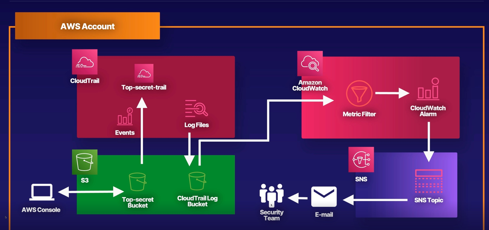

# AWS Access Control Alerts with CloudWatch and CloudTrail


## Create an S3 Bucket

1. Create S3 bucket and upload some files

## Create a CloudTrail Trail

1. In the AWS Management Console, navigate to the CloudTrail service.
2. Click **Create trail**.
3. On the Choose trail attributes page, configure the following settings:
   - Name: Enter "top-secret-bucket-trail".
   - Storage location: Choose **Create new S3 bucket**.
   - _Trail log bucket and folder_: Use the suggested bucket.
   - Log file SSE-KMS encryption: Uncheck the **Enabled** option.
4. Click **Next**.
5. On the _Choose log events_ page, check the box next to **Data events** under _Event type_ to log only data events in CloudTrail.
6. Under _S3 Bucket_, uncheck the boxes next to **Read** and **Write** for the _All current and future S3 buckets_ option to allow us to select an individual bucket.
7. Under _Individual bucket selection_, select **Browse**.
8. In the new _Choose S3 bucket_ window, select the bucket listed under _Name_.
9. Click **Choose**.
10. Next to the **Browse** button, check the boxes next to **Read** and **Write**.
11. Click **Next**.
12. Review the attributes for your trail and click **Create trail**.
13. Go back to the S3 Management Console.
14. Upload new files.

## Create a CloudWatch Log Group

1. Open the CloudTrail Management Console in a new browser window or tab.
2. Click **Trails** in the left sidebar.
3. Click **top-secret-bucket-trail** to open it.
4. Scroll down to the _CloudWatch Logs_ header, and click **Edit**.
5. Under _CloudWatch Logs_, check the box next to **Enabled**.
6. Under _Log group_, select **New**.
7. Under _Log group name_, change the name to just "aws-cloudtrail-logs".
8. Under _IAM Role_, select **New**.
9. Under _Role name_, enter "CloudTrailRole".
10. Click **Save changes**.
11. Go back to the CloudWatch Management Console.
12. In the left navigation menu, click **Logs**.
13. Under _Logs_, click **Log groups**.
14. In the console, under _Log groups_, click the name of the log stream to open it.
15. Add files to S3 bucket
16. Click **More** > **Download**.
17. Go back to the CloudWatch Management Console.
18. Wait a few minutes and refresh the page until logged events appear.

## Set Up a CloudWatch Alarm

1. In the CloudWatch Management Console, click **Logs** in the left navigation bar.
2. Click on **Log groups** in the left navigation bar.
3. In the console, select the log group under _Log group_.
4. Click **Actions**.
5. From the dropdown menu, select **Create metric filter**.
6. Under _Filter Pattern_, enter the following:
    ```bash
    { ($.eventSource = s3.amazonaws.com) && (($.eventName = PutObject) || ($.eventName = GetObject)) }
    ```
7. Click **Test Pattern**.
8. Click **Show test results**.
9. Click **Next**.
10. Configure the following settings:
 - _Filter name_: Enter "ACLMetricFilter".
 - _Metric namespace_: Enter "ACLMetricFilters".
 - _Metric name_: Enter "ACLLogMetric".
 - _Metric value_: Enter "1".
11. Click **Next**.
12. Click **Create metric filter**.
13. Under _Metric filters (1)_, select our newly created MetricFilter filter.
14. Click **Create alarm**.
15. On the _Specify metric and conditions_ page, configure the following settings under _Conditions_:
 - _Threshold type_: Select **Static**.
 - _Whenever LogMetric is_...: Select **Greater**.
 - _than_...: Enter "1".
16. Click **Next**.
17. On the _Configure actions_ page, configure the following settings under _Notification_:
 - _Alarm state trigger_: Select **In alarm**.
 - _Select an SNS topic_: Select **Create new topic**.
 - _Email endpoints that will receive the notification_...: Enter your email address.
18. Click **Create topic**.
19. Open your email client and check for an email from AWS Notifications.
20. Open the email, and click the **Confirm subscription** link.
21. Go back to the AWS Console.
22. Click **Next**.
23. Under _Alarm name_, enter a name, like "AccessS3Secrets". You can give the alarm a description as well, but this is optional.
24. Click **Next**.
25. Click **Create alarm**.
26. Go back to the S3 Management Console.
27. Select one of the files in the S3 bucket, and click **Download**.
28. Repeat these steps for the other two files in the S3 bucket.
29. Upload an additional test file by clicking **Upload**.
30. Click **Add files**.
31. Select a file from your computer and click **Upload**.
32. Click **Close**.
33. Go back to your email client and check for an email from AWS Notifications.
