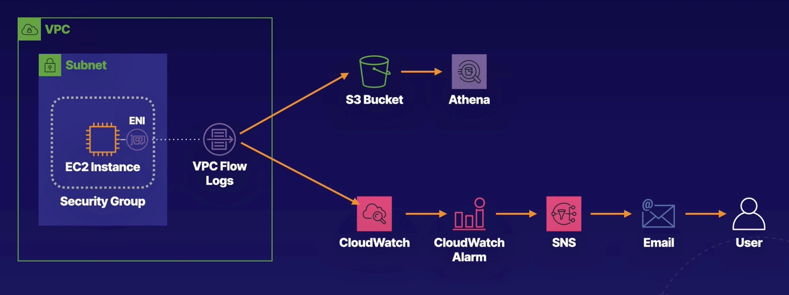

### Create a CloudWatch Log Metric Filter


# Create a CloudWatch Log Group and VPC Flow Logs to CloudWatch

## Create a VPC Flow Log to S3

1. Navigate to **VPC** and select your VPC .

5. Toward the bottom of the screen, select the **Flow logs** tab.

6. On the right, click **Create flow log**.

7. Fill in the flow log details:

   - **Name**: You can leave this field blank.
   - **Filter**: Ensure that All is selected.
   - **Maximum aggregation interval**: Select 1 minute.
   - **Destination**: Select Send to an Amazon S3 bucket.

8. Get the S3 bucket ARN:

   - In a new browser tab, navigate to S3.
   - Select the radio button next to the provided bucket.
   - Click **Copy ARN**.

9. Navigate back to the **VPC Management Console** tab and fill in the rest of the flow log details:

   - **S3 bucket ARN**: In the text field, paste your copied S3 bucket ARN.
   - **Log record format**: Ensure that AWS default format is selected.

10. Leave the other fields as the default settings and click **Create flow log**.

11. Your flow log is created.

12. From the **Your VPCs** page, select the **Flow logs** tab.

13. Review the flow log details and verify that it shows an **Active** status.

14. Navigate back to the **S3 Management Console** tab.

15. Select your bucket name, and then select the Permissions tab.

16. Review the bucket policy and note that it is modified automatically by AWS when you create flow logs so that the flow logs can write to the bucket.

## Create the CloudWatch Log Group and VPC Flow Log

# Setting Up VPC Flow Logs in CloudWatch

1. In a new browser tab, navigate to **CloudWatch**.

2. In the CloudWatch sidebar menu, navigate to **Logs** and select **Log groups**.

3. Click **Create log group**.

4. In the **Log group name** field, enter _VPCFlowLogs_.

5. Click **Create**.

6. Navigate back to the **VPC Management Console** tab and ensure the Flow logs tab is still selected.

7. On the right, click **Create flow log**.

8. Fill in the flow log details:

   - **Name**: You can leave this field blank.
   - **Filter**: Ensure that All is selected.
   - **Maximum aggregation interval**: Select 1 minute.
   - **Destination**: Ensure that Send to CloudWatch Logs is selected.
   - **Destination log group**: Click into the field and select your **VPCFlowLogs** log group.
   - **IAM role**: Use the dropdown to select the **DeliverVPCFlowLogsRole** role.
   - **Log record format**: Ensure that **AWS default format** is selected.
   
9. Click **Create flow log**

10. From the **Your VPCs** page, ensure the **Flow logs** tab is selected.

Review the flow log details and verify that the new flow log shows an **Active** state.

Navigate back to the **CloudWatch Management Console** tab.

Select the **VPCFlowLogs** log group name.

You should see there are currently no log streams. Remember, it may take some time before the flow logs start populating data.

## Generate Network Traffic
Generate traffic by login/logout activity on EC2 instance, and changing security group to allow/deny ssh access

# Create CloudWatch Filters and Alerts

## Create a CloudWatch Log Metric Filter


1. Navigate back to the **CloudWatch Management Console** tab.

2. In the CloudWatch sidebar menu, navigate to **Logs** and select **Log groups**.

3. Select the **VPCFlowLogs** log group name.

You should now see a log stream. If you don't see a log stream listed yet, wait a few more minutes and refresh the page until the data appears.

4. Select the listed log stream name and review the data.

5. Use the breadcrumb along the top of the page to select **VPCFlowLogs**.

6. Select the **Metric filters** tab and then click **Create metric filter**.

7. In the **Filter pattern** field, enter the following pattern to track failed SSH attempts on port 22:
```
[version, account, eni, source, destination, srcport, destport="22", protocol="6", packets, bytes, windowstart, windowend, action="REJECT", flowlogstatus]
```
8. Use the **Select log data** to test dropdown to select **Custom log data**.

9. In the **Log event messages** field, replace the existing log data with the following:
```
2 086112738802 eni-0d5d75b41f9befe9e 61.177.172.128 172.31.83.158 39611 22 6 1 40 1563108188 1563108227 REJECT OK
2 086112738802 eni-0d5d75b41f9befe9e 182.68.238.8 172.31.83.158 42227 22 6 1 44 1563109030 1563109067 REJECT OK
2 086112738802 eni-0d5d75b41f9befe9e 42.171.23.181 172.31.83.158 52417 22 6 24 4065 1563191069 1563191121 ACCEPT OK
2 086112738802 eni-0d5d75b41f9befe9e 61.177.172.128 172.31.83.158 39611 80 6 1 40 1563108188 1563108227 REJECT OK
```
10. Click **Test pattern** and then review the results.

11. Click **Next**.

12. Fill in the metric details:

    - **Filter name**: In the text field, enter dest-port-22-rejects.
    - **Metric namespace**: In the text field, enter a name (e.g., vpcflowlogs).
    -  **Metric name**: In the text field, enter SSH Rejects.
    - **Metric value**: In the text field, enter 1.
13. Leave the other fields blank and click **Next**.

14. Review the metric details and then click **Create metric filter**.

## Create an Alarm Based on the Metric Filter

1. After the metric filter is created, ensure that the **Metric filters** tab is selected.

2. In the **Metric filter** details, check the checkbox to the right of the **dest-port-22-reject filter**.

3. On the right, click **Create alarm**.

    The **Alarms** page opens in a new browser tab automatically.

5. Specify the metric conditions:

    - **Period**: Use the dropdown to select 1 minute.
    - **Threshold type**: Ensure that Static is selected.
    - **Whenever SSH Rejects is...**: Select Greater/Equal.
    - **than...**: In the text field, enter 1.
The metric will trigger an alarm whenever there is one or more reject messages within a one-minute period.

6. Click **Next**.

7. Configure the alarm actions:

    - **Alarm state trigger**: Ensure that In alarm is selected.
    - **Send a notification to the following SNS topic**: Select Create a new topic.
    - **Create a new topic**...: Leave the default topic name.
    - **Email endpoints that will receive the notification**...: In the text field, enter an email address (this can be your real email address or a sample address like _user@example_.com), and then click **Create topic**.

    *Note*: If you entered your real email address, open your email inbox and click the Confirm Subscription link you received in the SNS email.

8. Click **Next**.

9. In the **Alarm name** field, enter _SSH rejects_.

10. Click **Next**.

11. Review the alarm details and then click **Create alarm**.

The alarm is created but will take some time to start populating data.

# Use CloudWatch Logs Insights

1. In the CloudWatch sidebar menu, navigate to Logs and select **Logs Insights**.

2. Use the **Select log group(s)** search bar to select **VPCFlowLogs**.

3. In the right-hand pane, select **Queries**.

4. In the **Sample queries** section, expand **VPC Flow Logs** and then expand **Top 20 source IP addresses with highest number of rejected requests**.

5. Click **Apply** and note the changes applied in the query editor.

6. Click **Run query**.

    After a few moments, you'll see some data start to populate.