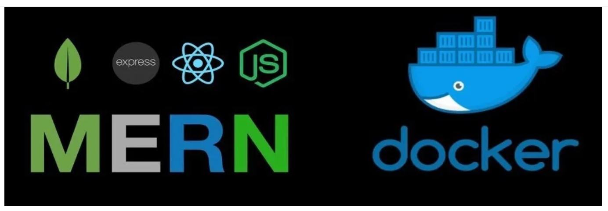

## Deploy MERN Stack on ECS


1. Clone repo
```bash
https://github.com/mohamedsamara/mern-ecommerce.git
```
2. Create Dockerfile in ```client``` folder
    ```bash
    # Dockerfile for React client

    # Build react client
    FROM node:10.16-alpine

    # Working directory be app
    WORKDIR /usr/src/app

    COPY package*.json ./

    ###  Installing dependencies

    RUN npm install --silent

    # copy local files to app folder
    COPY . .

    EXPOSE 3000

    CMD ["npm","start"]
    ```
3. Build react-app
    ```bash
    docker build -t react-app .
    ```
4. Create ```Dockerfile``` in server directory
    ```bash
    #  Dockerfile for Node Express Backend

    FROM node:10.16-alpine

    # Create App Directory
    RUN mkdir -p /usr/src/app
    WORKDIR /usr/src/app

    # Install Dependencies
    COPY package*.json ./

    RUN npm install --silent

    # Copy app source code
    COPY . .

    # Exports
    EXPOSE 5000

    CMD ["npm","start"]
    ```
5. Build backend
    ```
    docker build -t node-app .
    ```
6. Push all client and server images to ECR

## Using  Docker compose file
1. docker-compose.yaml
    ```bash
    version: '3.7'

    services:
      server:
        build:
          context: ./server
          dockerfile: Dockerfile
        image: myapp-server
        container_name: myapp-node-server
        command: /usr/src/app/node_modules/.bin/    nodemon server.js
        volumes:
          - ./server/:/usr/src/app
          - /usr/src/app/node_modules
        ports:
          - "5000:5000"
        depends_on:
          - mongo
        env_file: ./server/.env
        environment:
          - NODE_ENV=development
        networks:
          - app-network
      mongo:
        image: mongo
        volumes:
          - data-volume:/data/db
        ports:
          - "27017:27017"
        networks:
          - app-network
      client:
        build:
          context: ./client
          dockerfile: Dockerfile
        image: myapp-client
        container_name: myapp-react-client
        command: npm start
        volumes:
          - ./client/:/usr/app
          - /usr/app/node_modules
        depends_on:
          - server
        ports:
          - "3000:3000"
        networks:
          - app-network

    networks:
        app-network:
            driver: bridge

    volumes:
        data-volume:
        node_modules:
        web-root:
          driver: local
    ```
2. Creating the Build
    ```bash
    docker-compose build
    ```
3. Starting the Services
    ```bash
    docker-compose up
    ```
4. Maintenance & Inspection
    ```bash
    docker-compose logs
    ```
5. Stopping the containers
    ```bash
    docker-compose stop
    ```

### Common use cases of Docker Compose
1. **Development environments**

    The Compose file provides a way to document and configure all of the application's service dependencies (databases, queues, caches, web service APIs, etc). Using the Compose command line tool you can create and start one or more containers for each dependency with a single command (docker compose up).

2. **Automated testing environments**
    
    Compose provides a convenient way to create and destroy isolated testing environments for your test suite.
3. **Single host deployments**
    
