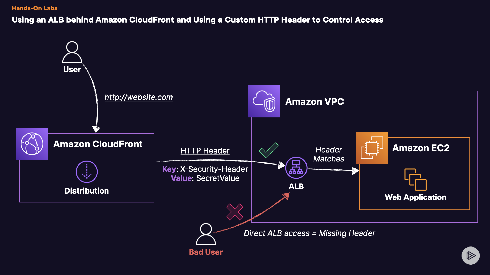

# Using an ALB behind Amazon CloudFront and Using a Custom HTTP Header to Control Access

## Introduction

In this lab, you'll learn to boost the security of a web app on AWS using CloudFront, ALB, and EC2. You'll restrict public access effectively by integrating these services.

## Solution
Log in to the AWS Management Console using the credentials provided on the lab instructions page. Make sure you're using the `us-east-1` Region.

## 1. Testing Web Application
Let's test our simple load-balanced web application before restricting access!

1. Navigate to the Amazon EC2 console.
2. Find and select **Load Balancers** from the _Load Balancing_ menu on the left-hand side.
3. Creat Application Load Balancer (ALB)  named `OurLoadBalancer`.
4. Copy and then paste the **DNS name** from the _Details_ pane into a new tab. **Ensure you use HTTP and not HTTPS**.
5. You should see a simple web page with a button on there. Click the button to test. It should generate a random string!
## 2. Create the CloudFront Distribution
Let's create a new distribution for us to front our ALB.

1. Navigate to the **CloudFront** console in a new tab.

2. From the left-hand menu, find and select **Distributions**.

3. Click on **Create a CloudFront distribution**.

4. Start with the **Origin** options. For _Origin domain_, choose the **OurLoadBalancer** from the dropdown menu.(_AWS is known to have issues in the console. If you do **NOT** see your ALB listed as an available origin, then simply enter the DNS name of the ALB._)

5. For the _Protocol_, select **HTTP only** (_This is only due to sandbox restrictions_)

6. Leave the other defaults for the _Protocol_ options.

7. Leave _Origin path_ - _optional blank_.

8. (Optional) Enter a new distribution name for easy reference.

9. Under **Add custom header - optional**, click on **Add header**.

10. For the name, use `X-Custom-Secret`. For the value, use a random string of your choice, like a UUID for example. (_Avoid special characters just for this lab and be sure to copy the Header Value for later_).

11. Skip down to _Default cache behavior_.

12. For the _Viewer protocol policy_ select the **Redirect HTTP to HTTPS** radio button.

13. Move to _Cache key and origin requests_.

14. Select the _Cache policy and origin request policy (recommended)_ radio button.

15. For _Cache policy_ select **CachingOptimized**.

16. Move down to _Web Application Firewall (WAF)_.

17. Select **Do not enable security protections**.

18. Skip down to the bottom and select **Create distribution**.

19. It will take several minutes to finish creating your distribution. For now, we can move on to the next section.

## 3. Create ALB Listener Rule
Let's add the restriction to our listener rules for our ALB!

1. Navigate to the **Amazon EC2** console in a new tab.
2. Find and select **Load Balancers** from the _Load Balancing_ menu on the left-hand side.
3. Find and select the Application Load Balancer (ALB) starting with `OurLoadBalancer`.
4. Select **Listeners and rules** from the ALB's menu.
5. Click on the **HTTP:80** listener to edit it.
6. Select the **Add rule** button.
7. For _Name and tags_ provide an easy to reference name (Example: _Header Check_).
8. Click **Next**.
9. Select **Add condition**.
10. Under _Rule condition_ types, choose **HTTP header** from the dropdown.
11. Within the _HTTP header_ name field enter `X-Custom-Secret`.
12. For the _HTTP header_ value field enter your random string from the **Create the CloudFront Distribution steps** completed previously.
13. Click on **Confirm**.
14. Click **Next**.
15. For _Actions and Action types_, select **Forward to target groups**.
16. From the _Target group_ dropdown select the pre-created target group called **WebServer-tg**.
17. Click **Next**.
18. Under _Rule_: _Header Check_, set the _Priority_ to **1**.
19. Click on **Next**.
20. Review the settings and then click **Create**.
21. Once back in the _Listener rules_ menu, find and select the **Default** rule.
22. Click on **Actions** then **Edit rule**.
23. Within the menu, for _Default actions_, choose the **Return fixed response** radio button for _Routing actions_.
24. Set the _Response code_ to `403`, and set the _Response body - optional_ field to your own custom message. (Example: _Missing required HTTP Header_).
25. Click on **Save changes**.
## 4. Testing!
Now let's check our finished project out! **NOTE**: You may have to wait a few more minutes for the CloudFront distribution to finish before testing.

1. Navigate back to the ALB's DNS name and refresh the page.
2. You should get a `403` status code and your custom HTTP response in the body!
3. Navigate to your CloudFront distribution page.
4. Find and copy the **Distribution domain name** (Example: **https://d8oknyay0fspy.cloudfront.net**).
5. Paste this into your browser.
6. It should work! Congrats!