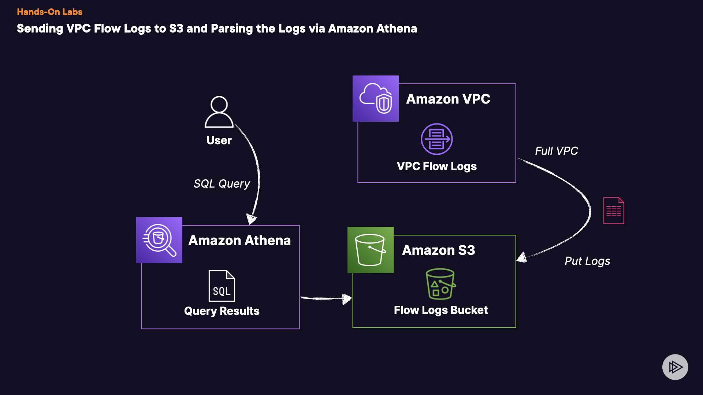

# Sending VPC Flow Logs to S3 and Parsing the Logs via Amazon Athena
Introduction
In this practical assignment, you'll delve into the utilization of Amazon Athena, Amazon S3, and VPC Flow Logs to establish a readily searchable analytics platform employing SQL-like queries.

## Solution

## 1. Create the Amazon S3 Bucket
1. Navigate to the **Amazon S3 console**.
2. Select **Buckets** from the left-hand menu.
3. Click **Create bucket**.
4. Under _General configuration_, select the **us-east-1** Region.
5. Make it a **General purpose** _Bucket type_.
6. Name your bucket. Be sure it starts with `csaa-hol-`.
7. Leave the rest of the settings as default.
8. Skip to the bottom and click **Create bucket**.
## 2. Create the VPC Flow Log and Generate Records
1. Navigate to the **VPC console** in a new tab.
2. Select the **Your VPCs** menu on the left-hand side.
3. Find and select **Your Custom VPC**.
4. Within the menu, find and select **Flow logs**.
5. Click on **Create flow log**.
6. Name your VPC Flow Log `vpc-to-s3`.
7. For _Filter_ select **All**.
8. Change _Maximum aggregation interval_ to **1 minute**.
9. For _Destination_ set it to **Send to an Amazon S3 bucket**.
10. Enter your recently created Amazon S3 bucket ARN. This can be found in the _Properties_ tab of your bucket. (Example: arn:aws:s3:::csaa-hol-2134324).
11. For _Log record format_ select **AWS default version** (_This is Version 2_).
12. For _Log file format_ select **Parquet**.
13. Check the box next to **Enable** under _Hive-compatible S3 prefix_.
14. Set the _Partition logs by time_ to **Every 1 hour (60 minutes)**.
15. Click on **Create flow log**.
16. Navigate to **Amazon EC2**.
17. Select **Load Balancers** from the left-hand menu.
18. Create Load Balancer **OurApplicationLoadBalancer** and copy the DNS name.
19. Browse to the DNS entry **using HTTP** and refresh a couple of times to generate traffic.
20. Wait a few minutes and then navigate to your new S3 bucket.
21. Refresh the objects list until you start seeing objects generated before you move on (_This could take several minutes. VPC Flow Logs are not real time._).
> The prefix will start with BUCKET_NAME/_AWSLogs_/aws-account-id=$ACCOUNT_ID

## 3. Create our Amazon Athena Table
1. Navigate to **Amazon Athena** in a new tab.

2. On the left-hand menu find and select **Query editor**.

3. Find the _Settings_ tab and select it, then click **Manage**.

4. For _Query result location and encryption_, browse for your S3 bucket and select it.

5. Append `/queries/` to the end of the bucket name then click **Save**. (Example: _s3://csaa-hol-213432inh32i4/queries/).

6. Go back to the **Query editor** window.

7. Edit a new Query within the _Query 1_ window that should be open. If there is no new query window, click the `+` button.

8. Paste the following code to create a new Database and click **Run**:

    ```sql
    CREATE
    DATABASE vpc_flow_logs_db;
    ```
9. Once successful, find and select the new database from the _Database_ dropdown menu under the _Data_ section of the Query Editor window.

10. Create a new query again via the `+` button.

11. Copy and paste the SQL query to create the new table and change the **BUCKET_NAME** within the SQL query to your S3 bucket name before running.
    ```sql
    CREATE
    EXTERNAL TABLE IF NOT EXISTS `vpc_flow_logs` (
      version int,
      account_id string,
      interface_id string,
      srcaddr string,
      dstaddr string,
      srcport int,
      dstport int,
      protocol bigint,
      packets bigint,
      bytes bigint,
      start bigint,
      `end` bigint,
      action string,
      log_status string
    )
    PARTITIONED BY (
      `aws-account-id` string,
      `aws-service` string,
      `aws-region` string,
      `year` string, 
      `month` string, 
      `day` string,
      `hour` string
    )
    ROW FORMAT SERDE 
      'org.apache.hadoop.hive.ql.io.parquet.serde.  ParquetHiveSerDe'
    STORED AS INPUTFORMAT 
      'org.apache.hadoop.hive.ql.io.parquet.    MapredParquetInputFormat' 
    OUTPUTFORMAT 
      'org.apache.hadoop.hive.ql.io.parquet.    MapredParquetOutputFormat'
    LOCATION
      's3://BUCKET_NAME/AWSLogs/'
    TBLPROPERTIES (
      'EXTERNAL'='true', 
      'skip.header.line.count'='1'
      )
    ```
12. After that completes, we need to refresh the Hive partitions so we can query data.

13. Open a new query editor tab via the `+` button.

14. Copy and then paste in the following SQL code which loads the Hive partitions in the metastore and repairs the table so we can query them. (_If you get an error code, follow the steps at the bottom of the guide titled Fix Errors and then restart the process in Athena again_):
    ```sql
    MSCK
    REPAIR TABLE vpc_flow_logs;
    ```
15. Now, open a new query editor window via the `+` button.

16. Enter your SQL queries against your new database and table (example below):

    ```sql
    SELECT *
    FROM vpc_flow_logs LIMIT 10;
    ```
17. Congrats! You are done!

## Fix Errors
If you are receiving a DDL error when attempting to run the **MSCK** command, execute these steps and restart the Athena process.

1. Open a new query editor window via the `+` button

2. Copy and paste the following code to drop the current _vpc_flow_logs_ table:
    ```sql
    DROP TABLE vpc_flow_logs;
    ```
3. After it drops the table, you can now drop the database to clear everything:

    ```sql
    DROP DATABASE vpc_flow_logs_db;
    ```
