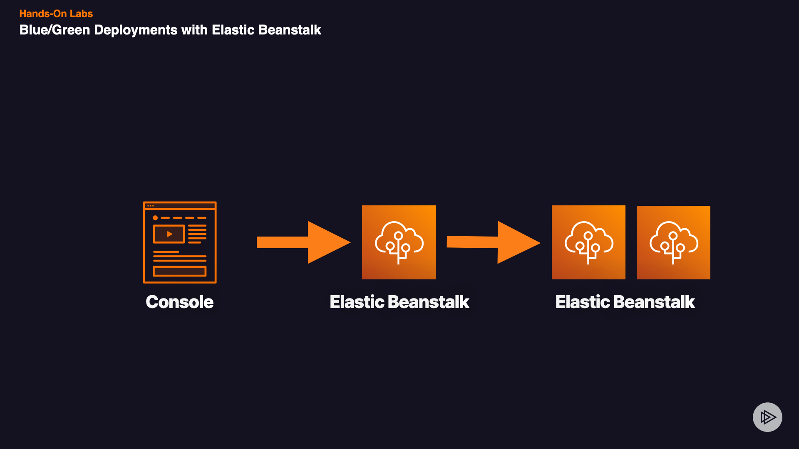

# Blue/Green Deployments with Elastic Beanstalk

## Introduction
During this lab session, we'll be establishing a blue/green deployment setup with Elastic Beanstalk. The process involves creating and duplicating an Elastic Beanstalk environment, which is crucial for maintaining uninterrupted service while experimenting with application changes. By the conclusion of this session, you'll gain the ability to orchestrate your own blue/green deployment using Elastic Beanstalk effectively.

## Solution
## Log In to AWS Console
1. Log in to the AWS Management Console
3. Select **VPCs**.
4. Click **Your VPCs**.
5. In the top right corner, click the **Actions** button.
6. From the dropdown menu, select **Create default VPC**.
7. Click the **Create default VPC** button.
## Create a service role for Elastic Beanstalk
1. Open the _Identity and Access Management (IAM)_ console.
2. Click **Roles**.
3. Click **Create role**.
4. Under_ Use case, choose Elastic Beanstalk, select Elastic Beanstalk - Customizable_, and click **Next**.
5. Click Next.
6. For Role name, type CustomServiceRoleForElasticBeanstalk.
7. Click Create role.
## Create an EC2 instance profile for Elastic Beanstalk
1. Open the _Identity and Access Management (IAM)_ console.
2. Click **Roles**.
3. Click **Create role**.
4. Under _Use case_, choose _EC2_.
5. Click **Next**.
6. Select the **AWSElasticBeanstalkReadOnly** policy name.
7. Click **Next**.
8. For _Role name_, type **CustomEC2InstanceProfileForElasticBeanstalk**.
9. Click **Create role**.
## Create Elastic Beanstalk Environment
1. In the search bar on top, enter _elastic beanstalk_.
2. From the search results, select **Elastic Beanstalk**.
3. Click the **Create application** button.
4. On the _Configure environment_ page, under **Application name**, enter _Blue green test_.
5. On the _Configure environment_ page, under **Platform**, select any available platform.
6. On the _Configure environment_ page, click **Next**.
7. On the _Configure service_ _access_ page, for _Service role_, select **Use an existing service role** and choose the **CustomServiceRoleForElasticBeanstalk** role.
8. On the _Configure service access page, for EC2 instance profile_, choose the **CustomEC2InstanceProfileForElasticBeanstalk** role.
9. On the _Configure service access page_, click **Next**.
10. On the _Set up networking, database, and tags - optional_ page, click **Next**.
11. On the _Configure instance traffic and scaling - optional_ page, click **Next**.
12. On the _Configure updates, monitoring, and logging - optional_ page, under System, click **Basic**.
13. On the _Configure updates, monitoring, and logging - optional page, under Managed updates_, uncheck the **Activated** box.
14. On the _Configure updates, monitoring, and logging - optional_ page, click **Next**.
15. On the _Review_ page, click **Submit**.
16. It may take a few minutes for Elastic Beanstalk to launch your environment.
## Clone Elastic Beanstalk Environment
1. Once the environment is successfully launched and you see the health of the environment is **Green**, click on **Environments** in the left-hand navigation menu or in the breadcrumb trail on top of the page.
2. Click the radio button next to **Bluegreentest-env**.
3. Click the **Actions** button.
4. From the dropdown menu, select **Clone environment**.
5. On the _Clone environment_ page, under _Existing service roles_, select **CustomServiceRoleForElasticBeanstalk**.
6. On the _Clone environment_ page, click **Clone**. It may take a few minutes for Elastic Beanstalk to clone and launch your environment.
7. Once the cloned environment is successfully launched and you see the health of the cloned environment is **Green**, click on **Environments** in the left-hand navigation menu or in the breadcrumb trail on top of the page. You should see that the health of both environments is **Green**. This means both environments are ready to be used in a blue/green deployment.
Conclusion