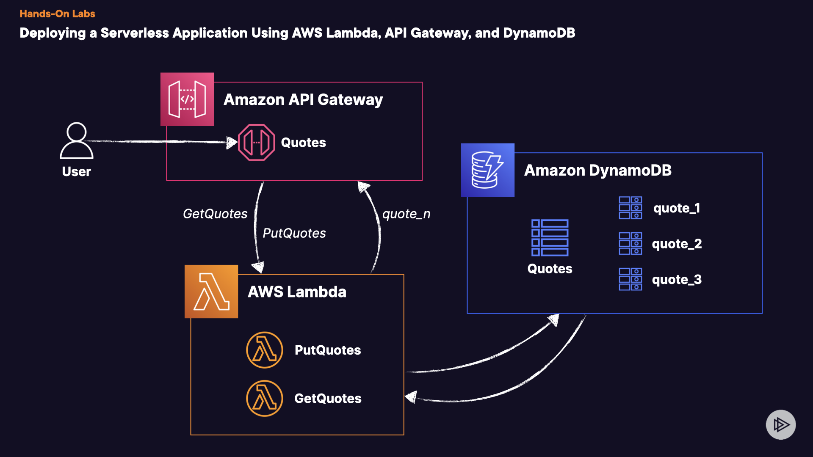

# Deploying a Serverless Application Using AWS Lambda, API Gateway, and DynamoDB


## Introduction
In this practical workshop, you'll delve into crafting and hosting a fully serverless application, harnessing key AWS services. You'll deploy the application through an architecture featuring Amazon API Gateway, AWS Lambda, and Amazon DynamoDB.

## Solution
Create role named `OurApiGatewayToCloudWatchLogsRole` and copy the ARN to your clipboard for later. It should look similar to this: arn:aws:iam:: 111111111111:role/OurApiGatewayToCloudWatchLogsRole

```json
{
  "Version": "2012-10-17",
  "Statement": [
    {
      "Action": [
        "logs:CreateLogGroup",
        "logs:CreateLogStream",
        "logs:PutLogEvents"
      ],
      "Resource": "*",
      "Effect": "Allow"
    }
  ]
}
```


## 1. Creating the DynamoDB Table
1. Navigate to the **DynamoDB** console.
2. Find and select the **Tables** menu on the left-hand side.
3. Click **Create table**.
4. Under _Table details_, for _Table name_, enter `Quotes`.
5. For _Partition Key_ enter `quote` and make it a **String** type.
6. For _Sort key_ enter `author` and make it a **String** type.
7. Under _Table_ settings, select **Customize settings**.
8. For _Table class_, choose **DynamoDB Standard**.
9. Move down to _Read/write_ _capacity_ settings.
10. For _Capacity mode_ choose **Provisioned**.
11. Set the _Read capacity Auto scaling_ to **On**.
12. Set the _Minimum capacity units_ to `1`, the _Maximum capacity units_ to `5`, and _Target utilization (%)_ to `20`.
13. Set the _Write capacity Auto scaling_ to **On**.
14. Set the _Minimum capacity units_ to `1`, the _Maximum capacity units_ to `5`, and _Target utilization (%)_ to `20`.
15. Move to the **Encryption at rest** settings.
16. Choose **AWS managed key**.
17. Skip to the bottom and select **Create table**.
18. Wait for the table to be created before moving on!
## 2. Create Lambda Functions
Now let's create the backend functions that will be used to generate and receive quotes!

### PutQuotes Function
1. Navigate to the **Lambda** console.
2. Click on **Functions** on the left-hand menu.
3. Find and select **Create function**.
4. Choose **Author from scratch**.
5. For the _Function name_ enter `PutQuotes`.
6. For the _Runtime_ select **Python 3.12**.
7. Ensure the _Architecture_ is set to **x86_64**.
8. Under _Permissions_, expand the dropdown menu for _Change default execution role_.
9. Within the dropdown menu, under _Execution role_, select **Create a new role from AWS policy templates**.
10. For the _Role_ _name_, enter `PutQuotesRole`.
11. Under the _Policy templates - optional_ dropdown, find and select **Simple microservice permissions**.
12. Scroll to the bottom and select **Create function**.
13. Once your function is created, find and select the function _Configuration_ tab on the screen (_Should be in the middle of the window_).
14. Within the configuration menu, under _General Configuration_, choose **Edit**.
15. Change the _Timeout_ to `1` min `0` sec, and then click **Save**.
16. Back within the _configuration_ screen, find and select **Environment variables**.
17. Click on **Edit**.
18. Choose **Add environment variable**.
19. For _Key_ enter `TABLE_NAME`, and for _Value_ enter `Quotes` (_the DynamoDB table name_).
20. Click **Save**.
21. Navigate back to the Code tab for the function.
22. Copy and past the Python code for PutQuotes **PutQuotes Lambda Function Code**
```python
import boto3
from botocore.exceptions import ClientError
import http.client
import json
import os

TABLE_NAME = os.getenv("TABLE_NAME", default="Quotes")


def get_quote():
    # Get a random quote from the internet
    conn = http.client.HTTPSConnection("zenquotes.io")
    conn.request("GET", "/api/random")
    response = conn.getresponse()

    if response.status == 200:
        data = json.loads(response.read().decode())
        quote = data[0]["q"]
        author = data[0]["a"]

        # Return the quote in the response
        return {"quote": quote, "author": author}
    else:
        # Handle any potential errors
        return {"body": f"Failed to fetch a quote. Error code: {response.status}"}


def put_quote(quote):
    dynamodb = boto3.resource("dynamodb")
    table = dynamodb.Table(TABLE_NAME)

    item = {
        "quote": quote["quote"],
        "author": quote["author"],
    }

    try:
        response = table.put_item(Item=item)
        return "Quote successfully written to DynamoDB."
    except ClientError as e:
        print(e)
        return "Error writing item to DynamoDB."


def lambda_handler(event, context):
    return put_quote(get_quote())
```

23. Select **Deploy**.
### GetQuotes Function
1. Navigate back to the _Functions_ menu within the Lambda console.
2. Find and select **Create function**.
3. Choose Author from scratch.
4. For the _Function_ _name_ enter `GetQuotes`.
5. For the _Runtime_ select **Python 3.12**.
6. Ensure the _Architecture_ is set to **x86_64**.
7. Under _Permissions_, expand the dropdown menu for _Change default execution role_.
8. Within the dropdown menu, under _Execution role_, select **Create a new role from AWS policy templates**.
9. For the _Role name_, enter `GetQuotesRole`.
10. Under the _Policy_ _templates_ - _optional_ dropdown, find and select **Simple microservice permissions**.
12. Scroll to the bottom and select **Create function**.
13. Once your function is created, find and select the function _Configuration_ tab on the screen (_Should be in the middle of the window_).
14. Within the configuration menu, under _General Configuration_, choose **Edit**.
15. Change the _Timeout_ to `1` min `0` sec, and then click **Save**.
16. Back within the _configuration_ screen, find and select **Environment variables**.
17. Click on **Edit**.
18. Choose **Add environment variable**.
19. For _Key_ enter `TABLE_NAME`, and for _Value_ enter `Quotes` (the _DynamoDB table name_).
20. Click **Save**.
21. Navigate back to the _Code_ tab for the function.
22. Copy and past the Python code for GetQuotes : **GetQuotes Lambda Function Code**
```python
import boto3
from botocore.exceptions import ClientError
import http.client
import json
import os

TABLE_NAME = os.getenv("TABLE_NAME", default="Quotes")


def get_quote():
    # Get a random quote from the internet
    conn = http.client.HTTPSConnection("zenquotes.io")
    conn.request("GET", "/api/random")
    response = conn.getresponse()

    if response.status == 200:
        data = json.loads(response.read().decode())
        quote = data[0]["q"]
        author = data[0]["a"]

        # Return the quote in the response
        return {"quote": quote, "author": author}
    else:
        # Handle any potential errors
        return {"body": f"Failed to fetch a quote. Error code: {response.status}"}


def put_quote(quote):
    dynamodb = boto3.resource("dynamodb")
    table = dynamodb.Table(TABLE_NAME)

    item = {
        "quote": quote["quote"],
        "author": quote["author"],
    }

    try:
        response = table.put_item(Item=item)
        return "Quote successfully written to DynamoDB."
    except ClientError as e:
        print(e)
        return "Error writing item to DynamoDB."


def lambda_handler(event, context):
    return put_quote(get_quote())
```
23. Select **Deploy**.
24. Move on to creating our Amazon API Gateway REST API!
## 3. Create Regional REST API
1. Navigate to the **Amazon API Gateway** console.
2. On the landing screen, find anselect **Build** under the _REST API_ option.
3. Under _API_ details, choose **New API**.
4. Set your _API_ name to `Quotes`.
5. (_Optional_) Provide a description if you want.
6. Set the _API endpoint type_ to **Regional**.
7. Now we can move on to creatinour resources and methods!
### Create the PutQuotes Resource
> Typically, you would leverage different methods for a singular resource, but for this lab, we are going to use two separate resources for simplicity of demonstrating how these pieces work together..
10. Within your newly created REST API, find and select **Resources** on the left-hand menu.
11. Click on **Create resource**.
12. Leave _the Resource path_ at `/`,and then set the _Resource name_ to `PutQuotes`.
13. Click **Create resource**.
14. Ensure you have selected your newly created resource, and then click on **Create method**.
15. Under _Method details_, for the _Method type_, select **ANY**.
16. For _Integration type_ select **Lambda function**.
17. Ensure the _Lambda proxyintegration_ is **disabled** for thismethod.
18. For the _Lambda function_ dropdown, choose **us-east-1** and thenselect the **PutQuotes** function fromthe dropdown.
19. Leave _Default timeout_ enabled.
20. Click on **Create method**.
## Create the GetQuotes Resource
> Typically, you would leveragedifferent methods for a singularresource, but for thisdemonstration, we are going to usetwo separate resources for clarity.
  .
1. Within your newly created RESTAPI, find and select **Resources** onthe left-hand menu.
2. Click on `Create resource`.
3. Set the _Resource_ _path to_ `/`, andthen set the _Resource name_ `toGetQuotes`.
4. Click **Create resource**.
5. Ensure you have selected your newly created resource, and then click on **Create method**.
6. Under _Method details_, for the _Method type_, select **ANY**.
7. For _Integration type_ select **Lambda function**.
8. Make sure that the _Lambda proxy_ _integration_ option is **enabled** forthe method.
9. For the _Lambda function_ _dropdown_, choose **us-east-1** and thenselect the **GetQuotes** function fromthe dropdown.
10. Leave _Default timeout_ enabled.
11. Click on **Create method**.
## 4. Deploy, Log, and Test
Now we can test it all out!

1. Within the Amazon **API Gateway** console, find and select your newly created _Quotes_ REST API.
2. Find and click on **Deploy API**.
3. Within the popup menu, for _Deploy API_, select **New Stage** for Stage.
4. Give your stage a name (Example: _development_).
5. (_Optional_) Provide a description if you want.
6. Click **Deploy**.
7. You should now be brought to your newly deployed stage.
8. Within left-hand menu of the API Gateway console, find and select **Settings**.
9. Under _Logging_, select **Edit**.
10. For _CloudWatch log role_, enter the IAM role ARN that was created for you. (_If you didn't find and copy this earlier, navigate to IAM, under Roles, find the_ `OurApiGatewayToCloudWatchLogsRole`, _and copy the ARN_)
11. Click **Save changes**.
12. Navigate back to your _Quotes_ REST API.
13. Select _Stages_ from the left-hand menu.
14. Find the _Logs and Tracing_ section, then select **Edit**.
15. Under _Logs and tracing settings, for CloudWatch logs_, select **Full requests and response logs** from the dropdown menu.
16. **Enable** X-Ray tracing.
17. Click **Save changes**.
18. Now you will be logging responses and requests, as well as collecting X-Ray metrics for each call.
19. Find and copy the _Invoke URL_ provided.
20. Open a new private/incognito tab, and then paste this URL into the address bar.
21. You should get an error message. This is due to us not providing any resources.
22. Now, at the end of the URL, enter `/PutQuotes` and hit Enter.
23. You will receive a message saying _Item successfully written to DynamoDB_ if working correctly.
24. Refresh several times to put more quotes into the table.
25. You can verify that the function is working as intended by exploring the DynamoDB table items.
26. Now, replace the `/PutQuotes` resource with `/GetQuotes` in the Invoke URL and hit enter.
27. You should receive a simple message with a quote! Refresh to randomly select quotes from the database.
28. Our serverless API is working!
## 5. Extra Challenge (Optional)
### Logging
You have the option to review the logs in CloudWatch for the API Gateway REST API. Each API stage you deploy will have its own designated log group.

### X-Ray
Leverage X-Ray to explore the execution times for each segment of your API call.

## Conclusion
Congratulations!

