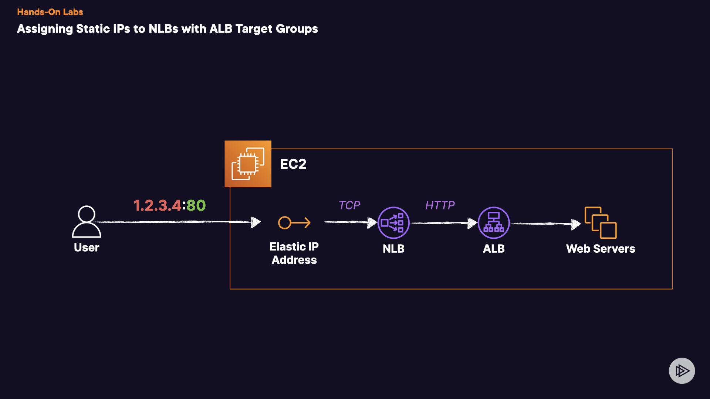

# Assigning Static IPs to NLBs with ALB Target Groups

## Introduction
Let's begin configuring a technology stack that incorporates multiple types of Elastic Load Balancers (ELB) to effectively manage a load-balanced web application. While the Application Load Balancer (ALB) offers a static DNS name, the associated IP addresses can change unpredictably, posing challenges, particularly with external DNS management platforms unable to reference ALB's alias records like Route 53 can. Employing a Network Load Balancer (NLB) alongside the ALB enables us to utilize a static IP address, simplifying DNS resolution management.

## Solution
## 1. Create Auto Scaling Group(ASG)
1. Create 2 webserver instance using user-data script from [here](https://github.com/DeepakBomjan/aws-cloud/blob/main/ELB/hol-elb-web-server-user-data.md) and Application Load Balancer
## 1. Create Target Group
Now, we need to create the Network Load Balancer (NLB) to front this ALB.

1. Under the **Load Balancing** menu on the left-hand side, select **Target Groups**.
2. Click on **Create target group**.
3. Find and click **Create target group**.
4. Under _Basic configuration_, for _Choose a target type_, select **Application Load Balancer**.
5. For _Target group name_, name it `ApplicationLoadBalancer-tg`.
6. Set the _Protocol: Port_ to **TCP** and **80** respectively.
7. Under _VPC_, find and select the **custom VPC** from the dropdown menu.
8. For _Health checks_ _set the Health check protocol_ tp **HTTP** and the _Health check path_ to /.
9. Click **Next**.
10. Under _Register Application Load Balancer_ select **Register now**.
11. From the _Application Load Balancer_ dropdown menu, find and select the *OurApplicationLoadBalancer* ALB.
Click **Create target group**.
## 2. Create Elastic IP Addresses (EIPs)
1. Navigate to **Elastic IPs** under _Network and Security_ in the left menu of the console.
2. Click **Allocate Elastic IP address**.
3. Under the _Elastic IP address settings_ menu, for _Network Border Group_, ensure it is set to **us-east-1**.
4. _Public IPv4 address_ _pool_ should be set to **Amazon's pool of IPv4 addresses**.
5. Click **Allocate**.
Repeat this process 2 more times. Make note of the EIP addresses before moving on. (_There should be 3 total EIPs_).
## 3. Create Network Load Balancer and Listener
1. Navigate to the Amazon EC2 console and select **Load Balancers**.
2. Click **Create load balancer**.
3. Under _Network Load Balancer_ select **Create**.
4. Under _Basic configuration_, for _Load balancer_ _name_ put in **WebServer-nlb**.
5. For _Scheme_ select **Internet-facing**.
6. For _IP_ _address type_ leave **IPv4**.
7. Move to **Network mapping**.
8. For the _VPC_ select the **custom VPC** (10.0.0.0/16).
9. Under _Mappings_ select all **3** Availability Zones (AZs) and then the respective **Public Subnet** for each AZ.
10. For each subnet chosen, within each of the _IPv4 address_ dropdown menus, find and select **Use an Elastic IP address**.
11. Within those dropdown menus, select one of the recently created EIPs for each AZ and subnet. Y**ou can only use a single EIP one time! Be sure to choose a unique one for each subnet**.
12. Within the _Security groups_ menu, for _Security groups_, select the **AllowTCPFromEverywhere** group and remove the default.
13. Under _Listeners and routing_, for the listener, leave the Protocol and Port as default (_Should be TCP and 80_).
14. Within the _Default action_ dropdown menu, select the **ApplicationLoadBalancer-tg** from earlier.
15. Skip to the bottom and select **Create load balancer**.
16. Wait until the **WebServer-nlb** is done provisioning and shows a status of _Active_ before moving on.
17. Now copy the DNS name provided for WebServer-nlb and confrim that it's working as expected.
18. With _WebServer-nlb_ selected, under the _Listeners_ section, click on the target group to open in another tab and confirm the health status is **Healthy**.
## Conclusion
Congratulations!
