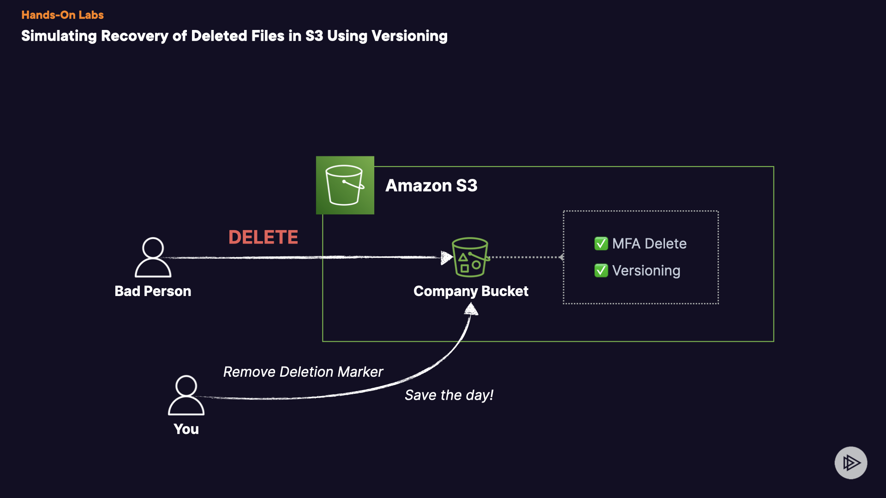

# Simulating Recovery of Deleted Files in S3 Using Versioning

# Introduction
During this practical session, you've been tasked with designing an architecture to safeguard against accidental or deliberate deletion of critical company files stored in Amazon S3. Now, let's proceed with implementing a process to recover specific S3 files!
## Solution
## 1. Create Test Files
1. Navigate to the **Amazon S3** and find the bucket that was created for you within the account. It should start with `csaa-ps-`.
2. Look within the bucket. It should be empty right now.
3. Navigate to the **Amazon API Gateway** console in a new tab.
4. Find and select the **MyAPI REST API** from the _APIs_ list.
5. On the left-hand menu, under _MyAPI_, find and select **Stages**.
6. There should be a **v1** stage listed.
7. Within the _v1_ stage details, copy the **Invoke URL** and open it in a new tab.
8. You should receive a simple response listing a set of files that were created for you within Amazon S3 (_File list uploaded to S3: ['important_file_657.txt', 'important_file_492.txt', 'important_file_56.txt', 'important_file_228.txt', 'important_file_848.txt']_).
9. Navigate back to the Amazon S3 bucket and refresh the object list.
10. There should be the same files created that the API response listed.
11. You can move on if so. If not, attempt the invoke the API again before moving on.
## 2. Delete Objects - Part 1
1. Navigate to the Amazon S3 console and select your S3 bucket.
2. Click on 1 or 2 of the checkboxes next to one of the **important_file_** TXT files .
3. Click on **Delete**.
4. Follow the prompt to **permanently delete** the object and then select **Delete objects**.
5. Notice the files are now fully deleted. You cannot recover these!
6. We can now move on.
## 3. Enable Versioning for Amazon S3 Bucket
1. Navigate to the Amazon S3 console and select your S3 bucket.
2. Within the S3 bucket window, find and click on **Properties**.
3. Look for the _Bucket Versioning_ section. Click on the **Edit** button for it.
4. Under _Bucket Versioning_, select **Enable**.
5. Click on **Save changes**.
6. You have now enabled versioning and can move on!
## 4. Delete Objects - Part 2
1. Click on the **Objects** tab again.
2. Select another object, make note of the object name, and then click on **Delete**.
3. Follow the prompt for deletion. Notice this time it says **delete** and not _permanently delete_ and click **Delete objects**.
4. After deleting the object, click **Close** to return to the objects list .
5. The file will appear to be gone, but it is not fully gone. We will confirm this in the next objective.
## 5. Recover Deleted Object
1. Navigate to the Amazon S3 console and select your S3 bucket, then load the objects list.
2. Find and select the **Show versions** toggle button.
3. You should now see the object you deleted earlier with the text **Delete marker** next to it.
4. Select the delete marker object, then click **Delete**.
5. Follow the prompt to **permanently delete** the deletion marker object .
6. Now you should see your original file in place!
## Conclusion
Congratulations!