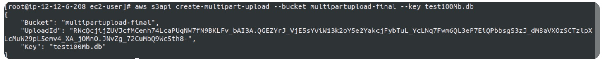
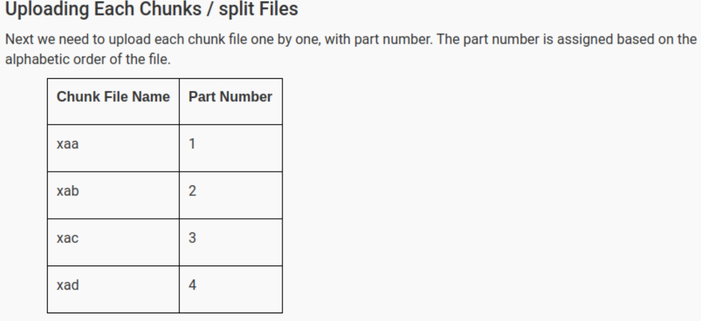
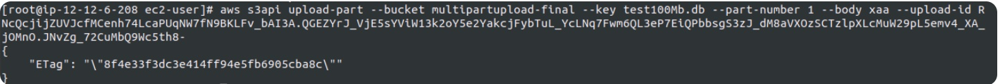
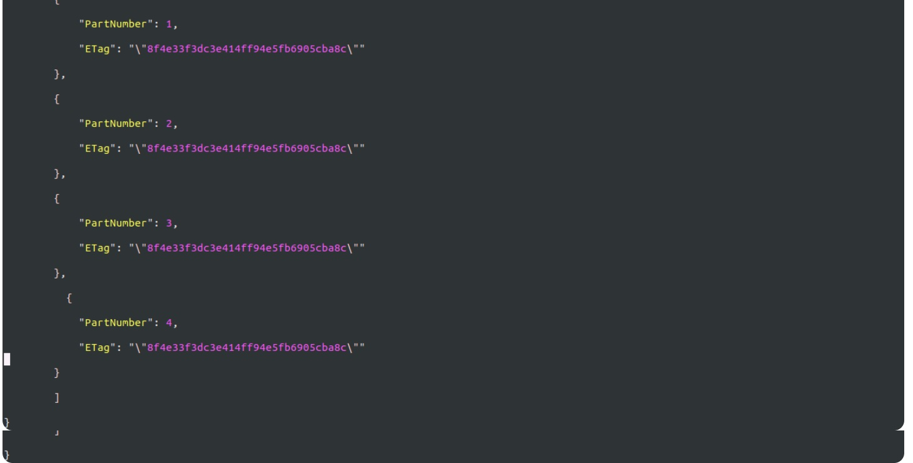
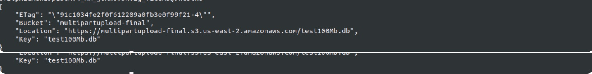

## Create large file
```bash 
head -c 10G /dev/urandom > sample.txt
fallocate -l 1G test.img
dd if=/dev/zero of=1g.img bs=1 count=0 seek=1G
dd if=/dev/zero of=1g.bin bs=1G count=1
```

## Split Files
```bash
split -l 10 filename
split <file> -b 10M 

```
## Create Multipart Upload

We are initiating the multi-part upload using AWS CLI command which will generate a UploadID, which will be later used for uploading chunks.

* Syntax: aws s3api create-multipart-upload --bucket [Bucket name] --key [original file name]


**Note: Please copy the UploadId into a text file, Like Notepad.**



* Syntax: aws s3api upload-part --bucket [bucketname] --key [filename] --part-number [number] --body [chunk file name] --upload-id [id]
* Example: aws s3api upload-part --bucket s3multipart-final --key video.mp4 --part-number 1 --body xaa --upload-id


Note: Copy the ETag id and Part number to your Notepad in your local machine.

* Now repeat the above CLI command for each chunk file [Replace --part-number & --body values with the above table values]

### Create a Multipart JSON file 
Create a file with all part numbers with their Etag values.

1. Creating a file named list.json

2. Copy the below JSON Script and paste it in the list.json file.

3. Save the File list.json

### Complete Multipart Upload
Now we are going to join all the chunks/split files together with the help of the JSON file we created in the above step.

* Syntax: aws s3api complete-multipart-upload --multipart-upload [json file link] --bucket [upload bucket name] --key [original file name] --upload-id [upload id]




## Using aws s3 cli

```bash
aws s3 cp large_test_file s3://DOC-EXAMPLE-BUCKET/
```
## Set concurrency
```bash
aws configure set default.s3.max_concurrent_requests 20
```

## Use low-level aws s3api commands
https://repost.aws/knowledge-center/s3-multipart-upload-cli