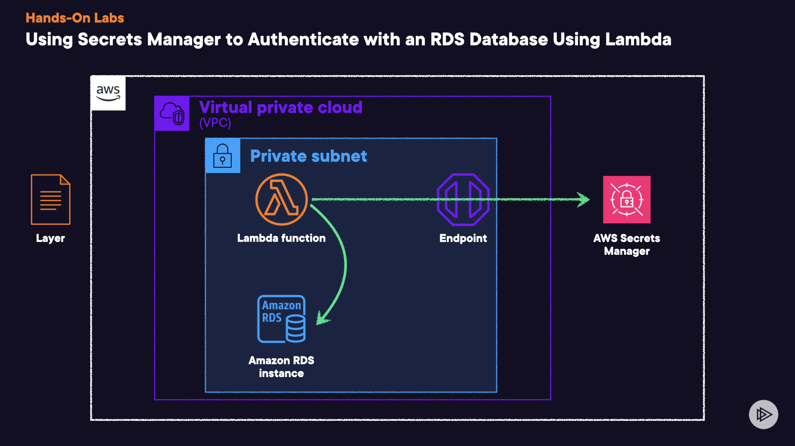

## Using Secrets Manager to Authenticate with an RDS Database Using Lambda


Download the MySQL Library ZIP file you'll need for the first lab objective.

## Create a Lambda Function
1. Create **RDS Database** copy the value for _Endpoint_. 
2. Create a lambda function.  
    **Function name**: Enter testRDS.  
    **Runtime**: Select Node.js 18.x.


## Create the MySQL Layer, and Copy Your Code to the Lambda Function

1. Click **Create layer**.
2. Set the following values:  
    * Name: Enter mysql.
    * Upload a .zip file: Select this option, and upload the file:
        1. Click Upload.
        2. Upload the MySQL Library ZIP file you downloaded earlier.
    * Compatible runtimes: Select Node.js 18.x.
7. Click **Create**.
8. On the left, click the hamburger menu, and select **Functions**.
9. Select the **testRDS** function.
10. Once on the **testRDS** page, scroll down to **Layers**.
11. In the **Layers** section, click **Add a layer**.
12. Select **Custom layers**, and select the following values:
    * **Custom layers**: Select **mysql**.
    * **Version**: Select the displayed version.
13. Click **Add**. Wait a minute for the function to update.
## Create Table in the RDS Database Using Lambda to Check Connectivity
1. In the **Code source** section, expand **testRDS** > **index.mjs**.

2. Delete the existing code in the **index.mjs** file, and replace it with the following code:

    ```javascript
    import mysql from 'mysql2/promise';

    export const handler = async (event, context,   callback) => {
      try {
        const connection = await mysql.createConnection ({
          host: "<RDS Endpoint>",
          user: "username",
          password: "password",
          database: "example",
        });

        // Create 'pets' table
        await connection.execute(`
          CREATE TABLE IF NOT EXISTS pets (
            id INT AUTO_INCREMENT PRIMARY KEY,
            name VARCHAR(255) NOT NULL,
            age INT NOT NULL
          )
        `);

        console.log('Table created: pets');

        // List all tables
        const [rows] = await connection.execute('SHOW   TABLES');
        console.log('Tables:');
        rows.forEach((row) => {
          console.log(row[`Tables_in_example`]);
        });

        connection.end();

        callback(null, {
          statusCode: 200,
          body: 'Tables listed successfully',
        });
      } catch (err) {
        console.error(err);
        callback(err, {
          statusCode: 500,
          body: 'Error listing tables',
        });
      }
    };
    ```
3. Replace the `<RDS Endpoint>` placeholder with the endpoint value you previously copied from RDS. Ensure it remains wrapped in quotes.

4. Click **Deploy**.

5. Once the function is updated, click **Test**.

6. In the **Configure test event** dialog, for **Event name**, enter test.

7. Click **Save**.

8. Click **Test** again.

    > Note: The `Response` should return a `statusCode` of `200`.

## Modify the Lambda IAM Role
1. Click the **Configuration** tab.
2. From the left menu, select **Permissions**. Review the permitted actions in the **Resource summary** section.
3. Click the link under **Resource summary** to open IAM.
4. On the right side of the **Permission policies** box, click **Add permissions** > **Attach policies**.
5. Search for and select the checkbox next to the **SecretsManagerReadWrite** policy name.
6. Click **Add permissions**.
7. Wait a few moments for your configurations to take effect.
8. Go back to Lambda, and click the **Refresh** icon at the top of the page. Observe all the additional permissions the role has access to.
## Create a Secret in Secrets Manager
1. In a new browser tab, navigate to **Secrets Manager**.
2. Click **Store a new secret**.
3. With **Credentials for Amazon RDS database** selected, set the following values:
    * **User name**: Enter _username_.
    * **Password**: Enter _password_.
    * **Encryption key**: Leave this as the default option.
    * **Database**: Select the listed DB instance.
4. Click **Next**.
5. On the next page, for **Secret name**, enter _RDScredentials_.
6. Leave the rest of the defaults as they are, and click **Next**.
7. On the next page, set the following values:
    *. Toggle the **Automatic rotation** option to enable it.
    *. Leave **Schedule expression builder** selected.
    *. **Time unit**: **Days**; enter 1.
    *. Leave **Create a rotation function** selected.
    *. **SecretsManager**: Enter _rotateRDS_.
    *. **Use separate credentials to rotate this secret**: Leave **No** selected.
8. Click **Next**.
9. Scroll down and click **Store**.

10. Once it's done, refresh your page and click **RDScredentials**.
11. In the **Secret value** section, click **Retrieve secret value**. You should see the password listed as "password."
12. Go back to the Lambda console, and click the hamburger menu. Then, select **Functions**. Click the **Refresh** icon if the page still shows only one function. You should also see the `SecretsManagerrotateRDS` function.
13. To check if the function is running, from the left menu, click **Applications**. The function should show as **Create complete**.
14. Back in Secrets Manager, refresh the page and click **Retrieve secret value** to see the secret again. You should no longer see "password" as the secret password value. Instead, the new value should be a string of characters.
## Test Connectivity from Lambda to RDS Using Credentials from AWS Secrets Manager
1. Go back to **Lambda**.

2. From the left menu, select **Functions**.

3. Select the **testRDS** function.

4. Select the **index.mjs** tab.

5. Remove all of the code from the **index.mjs** file.

6. Add the following new code:

    ```javascript
    import mysql from 'mysql2/promise';
    import AWS from 'aws-sdk';

    const secretName = 'RDScredentials';
    const region = 'us-east-1';
    const rdsEndpoint = '<RDS Endpoint>';
    const databaseName = 'example';

    AWS.config.update({ region: region });

    const secretsManager = new AWS.SecretsManager();

    export const handler = async (event, context) => {
      try {
        const data = await secretsManager.  getSecretValue({ SecretId: secretName }). promise();
        const secret = JSON.parse(data.SecretString ||  Buffer.from(data.SecretBinary, 'base64').    toString('ascii'));

        const { username, password } = secret;

        const connection = await mysql.createConnection ({
          host: rdsEndpoint,
          user: username,
          password: password,
          database: databaseName,
        });

        const [rows] = await connection.execute('SHOW   TABLES');

        console.log('Tables:');
        rows.forEach((row) => {
          console.log(row[`Tables_in_${databaseName}    `]);
        });

        connection.end();

        return {
          statusCode: 200,
          body: 'Tables listed successfully',
        };
      } catch (err) {
        console.error('Error:', err.message);
        return {
          statusCode: 500,
          body: 'Error listing tables',
        };
      }
    };
    ```
7. Replace the `<RDS Endpoint>` placeholder with the value you copied earlier in the lab.

8. Click **Deploy**.

9. Once the function is updated, click **Test**.

    > **Note**: Once complete, the `Response` should have a `statusCode` of `200`.

Conclusion
Congratulations — you've completed this hands-on lab!
