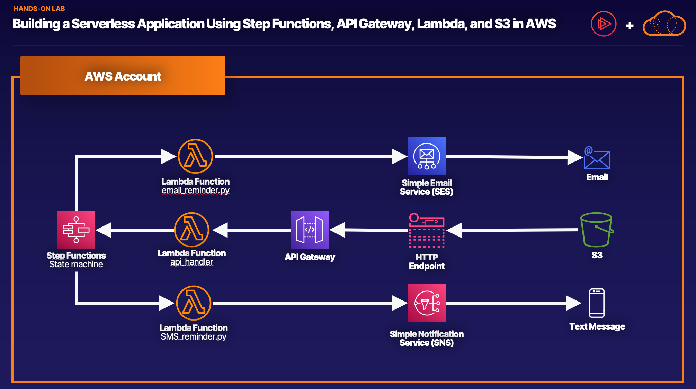

## Building a Serverless Application Using Step Functions, API Gateway, Lambda, and S3 in AWS


Log in to the AWS Management Console using the credentials provided on the lab instructions page. Be sure to use an incognito or private browser window to ensure you’re using the lab account rather than your own.

Note: Make sure you're in the N. Virginia (`us-east-1`) region throughout the lab.

Open the lab's [GitHub repository](https://github.com/JulieElkinsAWS/LALabs)  in a second tab. All of the code needed to complete this lab is available there.

## Create the Lambda Functions
1. In the GitHub repo, click on the file, ```email_reminder.py``` to open it.

2. Create Lambda function using this code
    * **Function name**: email
    * **Runtime**: **Python 3.8**

## Verify an Email Address in Simple Email Service (SES)
1. Go to **Amazon Simple Email Service** 

2. In the Amazon Simple Email Service (SES) console, Click the three horizontal line icon in the top left and choose **Verified identities**.

3. Click **Create identity**.

4. Choose **Email address**, enter your personal email address (or an email address you created specifically for this hands-on lab). Click **Create identity**.

5. In a new browser tab or email client, navigate to your email, open the Amazon SES verification email, and click the provided link.

    > **Note**: Check your spam mail if you do not see it in your inbox.

    You should see a **Congratulations**! page that confirms you successfully verified your email address.

6. Return to the AWS SES console tab.

You should now see **Verified** under **Identity status**. (**Note**: You may need to refresh the page.)

## Finish the email Lambda Function Setup
1. Return to the Lambda console in your first tab.

2. Within the `lambda_function` code, on line 3, delete the `YOUR_SES_VERIFIED_EMAIL` placeholder, and type in the email you just used, making sure to leave the single quotes around it.

3. Click **Deploy** in the **Code source** menu bar above the code.

    Your changes have now been deployed.

4. Scroll up on the same page to the **Function Overview** section, and copy the **Function ARN **by clicking the copy icon next to it, and paste it into a text file for later use in the lab.

## Create the sms Lambda Function
1. Create lambda function using code `sms_reminder.py`
    **Function name**: sms
    **Runtime**: **Python 3.8**


Scroll up on the same page to the Function Overview section, and copy the Function ARN by clicking the copy icon next to it, and paste it into a text file for later use in the lab. Keep this tab open.

## Create the `api_handler` Lambda Function
1. Create lambda function using code `api_handler.py`
    * **Function name**: _api_handler_
    * **Runtime**: **Python 3.8**


## Create a Step Function State Machine
1. Open the AWS Step Functions console in a new tab by typing _Step Functions_ into the search bar at the top of the screen. Right-click **Step Functions** from the drop-down menu, and select **Open Link in New Tab**.

2. In the AWS Step Functions console tab, click **Get started**.

3. In the pop-up window, click **Create your own** to create your own workflow from scratch.

4. On the new page, click on **Code** and delete all of the provided code.

5. Return to your GitHub repo tab, and click the back icon in your browser twice, to return to the main page of the repo.

6. Click the ```step-function-template.json``` file to open it.

7. Click **Raw** above the code to display the raw function code.

8. Copy all of the code to your clipboard.

9. Return to the Step Functions console tab, and paste the code on the left side of the screen.

10. On lines 33 and 49, replace the ```EMAIL_REMINDER_ARN``` placeholder value with the copied ARN for ```email``` that you should have copied over onto a text file earlier, being sure to leave the double quotes around the ARN.

11. On lines 38 and 59, replace the ```TEXT_REMINDER_ARN``` placeholder value with the copied ARN for ```sms```.

    You should now see the updated function diagram show up to the right of the code.

12. Click on the **Config** tab.

13. Leave the default name **MyStateMachine**.

14. Under **Permissions**, click the dropdown and select **RoleForStepFunction** under **Existing roles**.

15. Scroll down, and click **Create**.

    Your state machine should now be created.

16. On the **MyStateMachine** page, under **Details**, copy the ARN to your clipboard.

17. Return to the Lambda console in your first tab.

18. In the navigation line at the top of the page, click **Functions**.

19. Under **Functions**, select the **api_handler** function.

20. Scroll down to **Code source** and view the ```lambda_function.py``` code.

21. On line 6, replace the ```STEP_FUNCTION_ARN``` placeholder with the ARN you just copied.

22. Click **Deploy**.

## Create the API Gateway
1. Open the Amazon API Gateway console in a new tab by typing API Gateway into the search bar at the top of the screen. Right-click API Gateway from the drop-down menu, and select **Open Link in New Tab**.

2. In your Amazon API Gateway console tab, scroll down to **REST API (the one that does not say Private)**, and then select Build.

3. Under **API Details**, select **New API**.

4. Under **Settings**, set the following values:

    * **API name**: reminders
    * Leave **Description** blank.
    * **Endpoint Type**: Regional
5. Click **Create API** at the bottom of the screen.

    You should now be in your API Gateway, and you will see that you don't have any methods defined for the resource.

6. Click **Create method**.

7. In the dropdown that appears under **Method type**, select **POST** and set the following values:

    * **Integration type**: Lambda Function
    * **Use Lambda Proxy integration**: Select the checkbox.
    * **Lambda Region**: **us-east-1**
    * **Lambda Function**: Start typing, and then select, _api_handler_.
8. Click **Create method** at the bottom of the page

9. You should be back at the Resources page. Click **Create Resource**.

10. Under **Resource Name**, enter _reminders_.

11. Select the checkbox next to **CORS**.

12. Click **Create Resource** at the bottom of the page.

13. You should be back at the Resources page again. Click **Enable CORS**.

14. Under **Gateway responses**, check **Default 4XX** and click **Save** at the bottom of the page.

15. Back at the Resources page, click **Deploy API**.

16. In the **Deploy API** pop-up window, set the following values:

    * **Deployment stage**: **[New Stage]**
    * **Stage name**: _prod_
17. Click **Deploy**.

    > **Note**: You may ignore any Web Application Firewall (WAF) permissions warning messages if received after deployment.

18. At the top of the page, under **Stage details**, copy the **Invoke URL** and paste it into a text file for later use in the lab..

## Create and Test the Static S3 Website
1. Return to your GitHub repo tab, and click the back icon in your browser twice, to return to the main page of the repo.

2. Click **Code** in the top right above the files in the repo, and select **Download ZIP** to download all of the files in the repo.

3. Unzip and open the downloaded file, and then open your local ``static_website`` folder.

4. Open the `formlogic.js` file in a text editor.

5. On line 5 of `formlogic.js`, delete the `UPDATETOYOURINVOKEURLENDPOINT` placeholder. Paste in the **Invoke URL** you previously copied from API Gateway, being sure to keep `/reminders` on the end of the string.

6. Save the local file.

7. Return to your first AWS Management Console tab.

8. In the Amazon S3 console, click** Create bucket**.

9. Under **Object Ownership**, select **ACLs enabled**, and ensure **Bucket owner preferred** is selected.

12. Uncheck **Block all public access**.

13. Under **Block _all_ public access**, select **I acknowledge that the current settings might result in this bucket and the objects within becoming public**.

14. Leave the other defaults, scroll down, and click **Create bucket**.

15. Select the new bucket under **Buckets** to open it.

16. On the bucket page, click **Upload**.

17. On the **Upload** page, click **Add files** and select all of your local files from the `static_website` folder, and click **Open**. Or, drag all of your local files from the `static_website` folder into the **Drag and drop box** under **Upload**.

    * `cat.png`
    * `error.html`
    * `formlogic.js`
    * `IMG_0991.jpg`
    * `index.html`
    * `main.css`
18. Once all six of the files have been added, scroll down, and click **Permissions** to expand the access options.

19. Under **Predefined ACLs**, select **Grant public-read access**.

20. Under **Grant public-read access**, select **I understand the risk of granting public-read access to the specified objects**.

21. Click **Upload** at the bottom of the page.

22. Once you see the uploads have succeeded, click Close in the top right-hand corner of the page.

23. Click on the **Properties** tab under the bucket name.

24. Scroll down to **Static website hosting**, and click **Edit**.

25. On the **Edit static website hosting** page, under **Static website hosting**, select **Enable**.

26. Set the following values:

    * **Index document**: _index.html_
    * **Error document**: _error.html_
27. Click **Save changes** at the bottom of the page.

28. Scroll down again to **Static website hosting**, and click the URL below **Bucket website endpoint** to access the webpage.

29. Once you are on the static website, to test the service's functionality, set the following values:

    * **Seconds to wait**: _1_
    * **Message**: _Hello!_
    * _**someone@something.com**_: Your personal email address (This has to be the same one you verified with Simple Email Service earlier.)
30. Under **Reminder Type**, select **email**.
    You should see **Looks ok**. **But check the result below!** above the **Required sections**, and you should see `{"Status":"Success"}` at the bottom of the page.

31. In a new browser tab or email client, navigate to your email. You should now see a reminder email from the service.

    > **Note**: Check your spam folder if you do not see it in your inbox.

32. Navigate to your AWS Step Functions console tab.

33. In the **Executions** section, click on the refresh icon.

    You should see at least one execution displayed.

34. Click on one of the executions.

35. Scroll down to **Graph inspector** to view the event's visual workflow.


