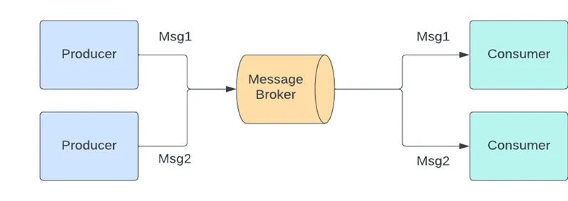
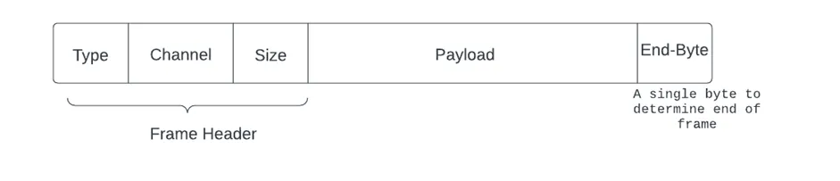
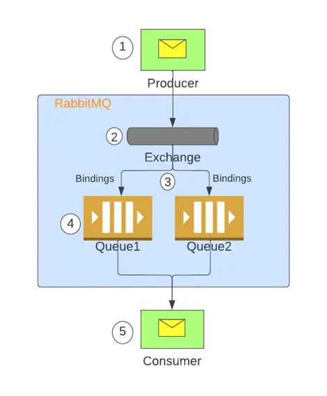
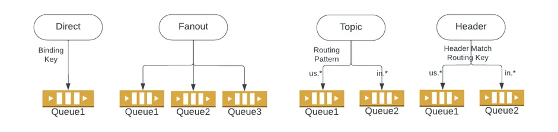

## RabbitMQ Tutorials
## RabbitMQ: Concepts and Best Practices

* modern applications - microservices architecture 
* can’t rely on request/response-based systems
* can impact the user experience if the client is a front-end application as the UI becomes unresponsive.
* asynchronous communication between the microservices
* This middle component is known as _Message Broker_.
* it simplifies incorporating heterogeneous applications in the system.
* Message Brokers provide the ability to que messages, allowing web servers to respond to requests quickly instead of being forced to perform resource-heavy procedures on the spot that may delay response time.

## RabbitMQ
* AMQP 0–9–1 (Advanced Message Queuing Protocol)
### Key Concepts

* **Producer**: Application that sends the messages.

* **Consumer**: Application that receives the messages.

* **Queue**: Stores messages that are consumed by applications

* **Connection**: A TCP connection between your application and the RabbitMQ broker.

* **Channel**: Lightweight connections that share a single TCP connection. Publishing or or consuming messages from a queue is done over a channel.

* **Exchange**: Receives messages from producers and pushes them to queues depending on rules defined by the exchange type. A queue must be bound to at least one exchange to receive messages.

* **Binding**: Bindings are rules that exchanges use (among other things) to route messages to queues.

* **Routing key**: A key that the exchange uses to decide how to route the message to queues. Think of the routing key as an address for the message.

* **Users**: It is possible to connect to RabbitMQ with a given username and password. Users can be assigned permissions such as rights to read, write, and configure privileges within the instance. Users can also be assigned permissions for specific virtual hosts.

* **Vhost, virtual host**: Virtual hosts provide logical grouping and separation of resources. Users can have different permissions to different vhost(s), and queues and exchanges can be created so they only exist in one vhost.
### Message Flow in RabbitMQ

These tutorials cover the basics of creating messaging applications using RabbitMQ.

## What can RabbitMQ do for you?

1. Messaging enables software applications to connect and scale
2. You may be thinking of data delivery, non-blocking operations or push notifications.
3. You may be thinking of data delivery, non-blocking operations or push notifications. Or you want to use publish / subscribe, asynchronous processing, or work queues. All these are patterns, and they form part of messaging.
4. RabbitMQ is a messaging broker - an intermediary for messaging. It gives your applications a common platform to send and receive messages, and your messages a safe place to live until received.

### Exchange Types

### Consumer Acknowledgements and Publisher Confirms
* Delivery processing confirmation from the consumer to the broker is known as consumer acknowledgment.

## [Which protocols does RabbitMQ support?](https://www.rabbitmq.com/protocols.html)

## [Exchanges and Exchange Types](https://www.rabbitmq.com/tutorials/amqp-concepts.html#exchanges)'

## [Part 1: RabbitMQ for beginners - What is RabbitMQ?](https://www.cloudamqp.com/blog/part1-rabbitmq-for-beginners-what-is-rabbitmq.html)

## HOLs
[Using Amazon MQ for RabbitMQ as an event source for Lambda](https://aws.amazon.com/blogs/compute/using-amazon-mq-for-rabbitmq-as-an-event-source-for-lambda/#:~:text=RabbitMQ%20is%20an%20open%2Dsource,service%20to%20a%20fulfillment%20service.)

[Using Python Pika with Amazon MQ for RabbitMQ](https://docs.aws.amazon.com/amazon-mq/latest/developer-guide/amazon-mq-rabbitmq-pika.html)

[Amazon MQ Workshop: Lab Guide](https://github.com/aws-samples/amazon-mq-workshop)