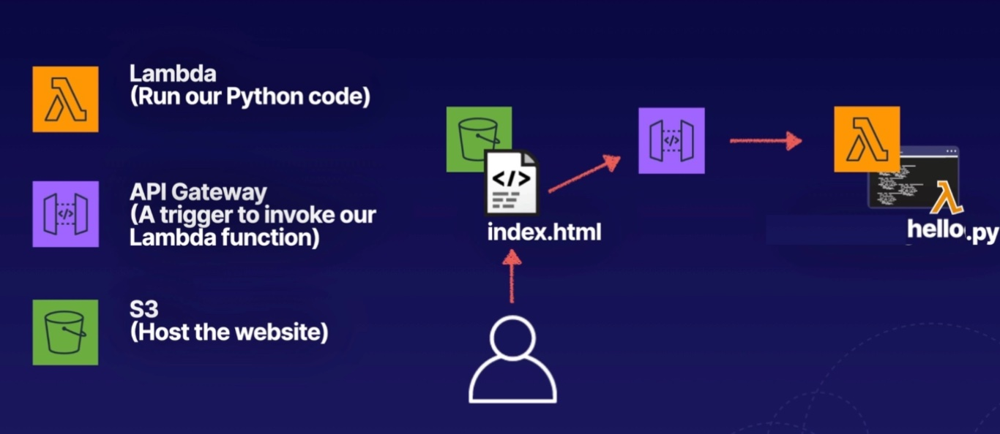

## Building a Serverless Website

### Deploy sample lambda function
```python
def lambda_handler(event, context):
    print("In lambda handler")
    
    resp = {
        "statusCode": 200,
        "headers": {
            "Access-Control-Allow-Origin": "*",
        },
        "body": "Keep learning serverless!"
    }
    
    return resp
```
### Create trigger as API gateway
1. **Create a new API**
2. Select API type to **HTTP API**
3. Select _Security_ as **Open**.
4. In _Additional settings_Select **Cross-origin resourcesharing(CORS)**
5. Click **Add**

### Create S3 Bucket
1. Disable **Block _all_ public access**
2. Enable **Static website hosting**.
3. Specify **Index document** and **Error document** - _optional_
4. Upload `index.html` and `error.html`
5. Copy below html file in index.html and update **MY_API_GATEWAY_ENDPOINT_URL** with actual api gateway endpoint url

#### index.html
```html
<html>
	<head>
		<script>
			function myFunction() {
				var xhttp = new XMLHttpRequest();
				xhttp.onreadystatechange = function() {
					if (this.readyState == 4 && this.status == 200) {
					document.getElementById("my-demo").innerHTML = this.responseText;
					}
				};
				xhttp.open("GET", "MY_API_GATEWAY_ENDPOINT_URL", true);
				xhttp.send();

			}

		</script>
	</head>
<body>
	<div align="center">
		<br>
		<br>
		<br>
		<br>
		<h1> <span id="my-demo">Hello World!</span></h1>
		<button onclick="myFunction()">Click me</button>	
	</div>

	</body>
</html>
```
6. Copy below content in `error.html`

### error.html
```html
<html>
   <head></head>
   <body>
      <h1>There has been an error!</h1>
   </body>
</html>
```