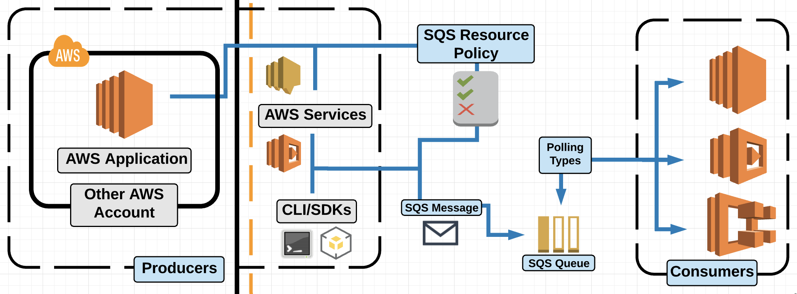

## Demo 1
### Demo Sidelining Messages with Dead Letter Queue
1. Create a lambda function to process the web order
2. Create dead letter queue
3. Create Primary Queue with DLQ enabled and point to the queue just created
4. Copy the primary queue url and populate in the lambda function environment variable
5. Go to primary queue and setup lambda trigger.
6. Select the lambda function and save
7. Send the message to queue
8. send correct message and check Cloudwatch log
9. send incorrect message and check Cloudwatch log
10. Go to Dead letter queue and receive.
## Demo 2
### Ordered Messages with SQS FIFO

## HOL 1
## Working with AWS SQS Standard Queues

Open 5 terminal window and login to the public instance


## Create a Standard SQS Queue (First Terminal)

1. In one of the windows, create a queue using the Python script:

    ```bash
    python3 create_queue.py
    ```

2. When the command finishes, we'll see the URL of our queue (e.g., _https://queue.amazonaws.com/xxxxxxxxxxxx/mynewq_). Copy that URL.

3. Open the `sqs_url.py` file:

    ```bash
    vim sqs_url.py
    ```

4. Update the file so it includes the URL you just copied:

    ```bash
    QUEUE_URL = 'https://queue.amazonaws.com/xxxxxxxxxxxx/mynewq'
    ```
    Save and quit the file by hitting **Escape** and entering **wq!**.

5. View the contents of the file to make sure it's updated:

    ```bash
    cat sqs_url.py
    ```

## Monitor the Queue (Second Terminal)
1. In another terminal window, run a script that will keep track of what's going on in our queue:

    ```bash
    python3 queue_status.py
    ```
    This will check on messages in our queue, so leave it running in the window. You may want to make this window smaller than the others to keep it out of the way while still keeping an eye on it.

## Send Data (Third Terminal)
1. In a third terminal, run a script that will start pushing data to the queue:

    ```bash
    python3 slow_producer.py
    ```
    We'll see a lot of information start to appear. After a few seconds, we'll also see the second/monitoring terminal window change, with the numbers starting to increase for the different kinds of messages.

2. Once the `slow_producer` script stops running (it will take a few minutes, and we should have 50 messages total), run the following script in the third terminal:

    ```bahs
    python3 fast_producer.py
    ```
    The difference between the `slow_producer` and `fast_producer` is the time they wait between sending messages — slow waits 10 seconds, and fast only waits 1 second.

    We'll end up with 100 messages total once it finishes running (it will take about a minute).

## Receive Messages and Extract Metadata (Fourth and Fifth Terminals)
1. In the fourth terminal window, run a script that will receive messages from the queue and extract some metadata from them:

    ```bash
    python3 fast_consumer.py
    ```
We'll see a lot of data start flowing in the fourth terminal. We'll also see (in the monitoring terminal window) the number next to _ApproximateNumberOfMessages_ start to drop.

2. No need to wait this time — in the fifth terminal, run the following:

    ```bash
    python3 slow_consumer.py
    ```
    This is just a slower version of the `fast_consumer` script (as evidenced by its name).

3. Keep an eye on the monitoring terminal window — we'll see the number of _ApproximateNumberOfMessages_ continue to drop. We now have 2 scripts running that are both snagging messages out of the queue, extracting data, and deleting them.

## Clean Up (Any Terminal)
1. We don't need to wait for the previous 2 scripts to finish. To cancel the processes, hit **Ctrl+C** in the monitoring window as well as the fourth and fifth terminal windows.

2. Run the following in any terminal window to remove all the messages from the queue:

    ```bash
    python3 purge_queue.py
    ```
## Run Everything at Once (All Terminals)
1. Keep the monitoring terminal window there to keep an eye on it while running all of the scripts. (If you need to re-run the command again, it's `python3 queue_status.py`.)

2. In the next terminal, run:

    ```bash 
    python3 slow_producer.py
    ```
3. In the next terminal, run:

    ```bash
    python3 slow_consumer.py
    ```
4. In the next terminal, run:

    ```bash
    python3 fast_consumer.py
    ```
    Watch the monitoring terminal window — the number of messages should start going down.

5. In the next terminal, run:

    ```bash
    python3 fast_producer.py
    ```
    In the first/monitoring terminal, we should see the number of messages start going back up again. This will continue until the `producer` scripts run out of data to read and the `consumer` scripts have processed all of the messages.

Eventually, the monitoring terminal window's 3 rows will all have 0 counts.